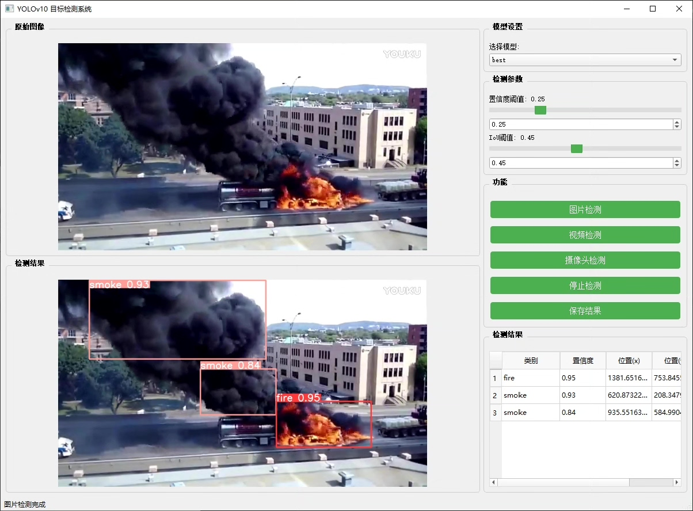
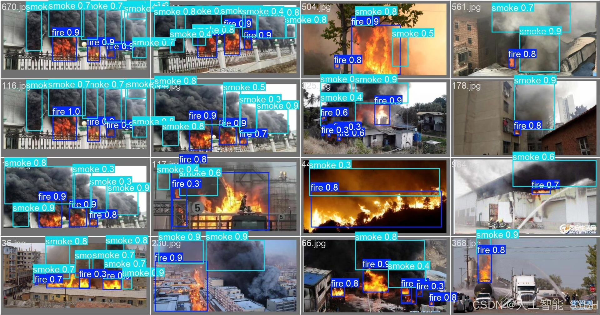
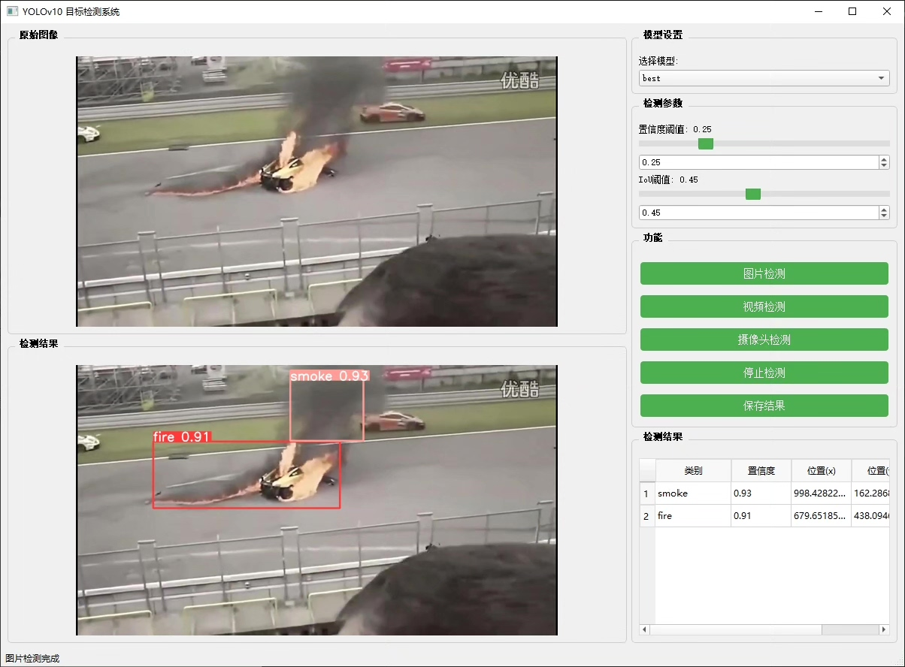
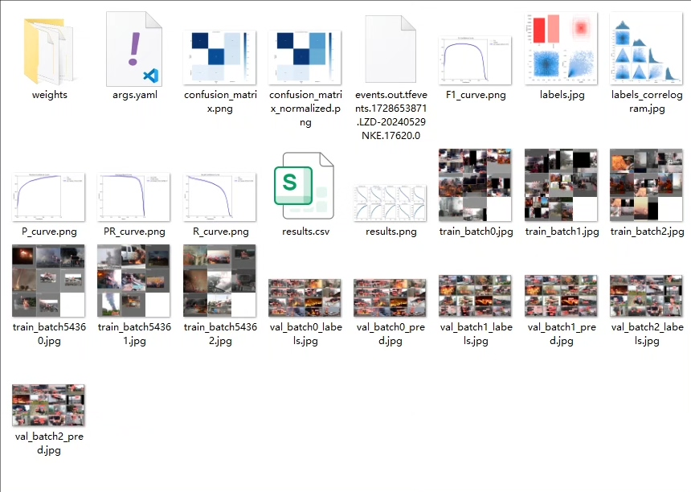
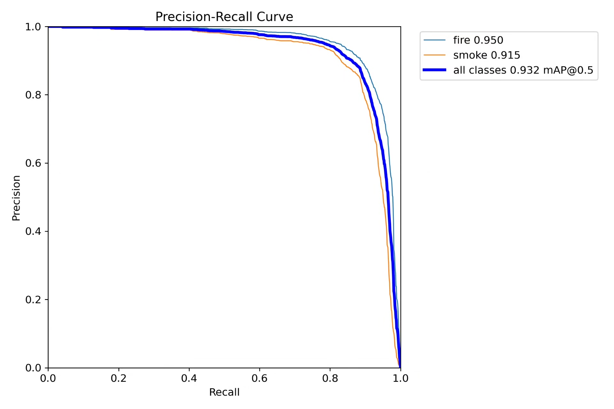
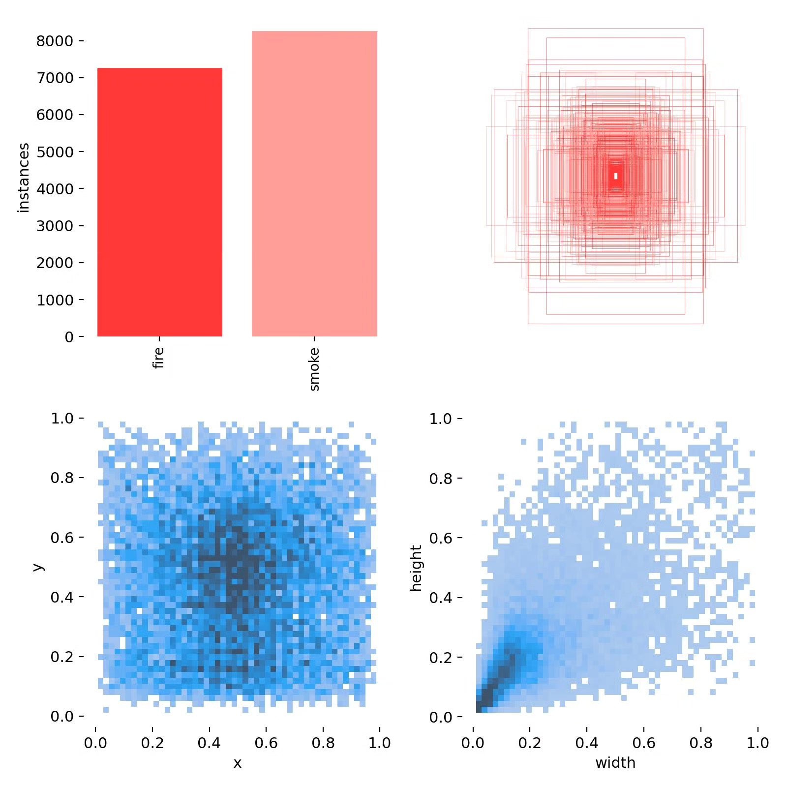
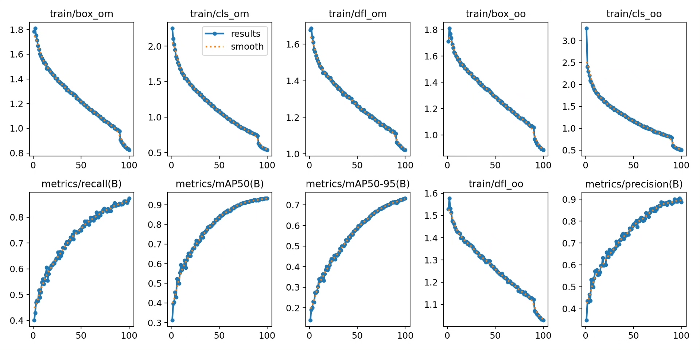
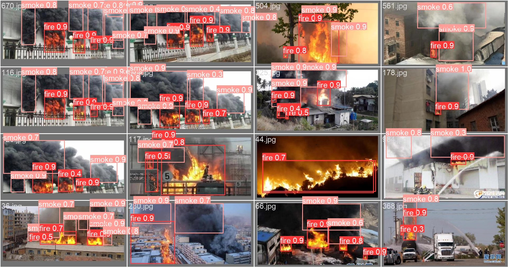

# Fire Smoke Detection System Based on YOLOv10 Deep Learning

## Body

Based on the YOLOv10 deep learning, a fire and smoke detection system (YOLOv10+YOLO dataset + UI interface + Python project source code + model)

The detection of fire and smoke is crucial in many fields, especially in fire monitoring, industrial safety, environmental protection, etc. The accurate and real-time recognition of the presence of fire and smoke can not only effectively reduce the loss caused by disasters, but also provide timely warning information for relevant departments. Therefore, this project has adopted the YOLOv10 (You Only Look Once) object detection technology, developed an efficient fire and smoke detection system, aiming to automate the identification of fire or early smoke phenomena through computer vision technology.

Training set: A total of 4832 images covering various scenes of fire and smoke.
Validation set: A total of 1000 images, mainly used during the training process to evaluate the performance of the model.
Test set: A total of 912 images, mainly used for final model evaluation, verifying the practical effect of the system.

The company's products have obtained the official commercial license certification of YOLO

Package after-sales service

After payment, we will provide WeChat ID for any questions, anytime

Environment configuration: We will provide a tutorial on environment configuration, and answer questions via WeChat.

Remote installation service: If you need remote configuration, an additional fee of 69 is required,
If the configuration fails, all fees are refunded (especially for old computers only refund installation fees)

Retraining dataset: After setting up the environment, you can train on your own computer.
If you need us to retrain, just pay 69 + computing power fees (2.5 yuan/hour)

Full package after-sales service

## Images

## Payment

Here is a pay link on Stripe ( https://buy.stripe.com/3cs8yP7sY87d0vu9AB ). Please contact me lonlonago@foxmail.com after funding $89, and I will send you a complete data files , thank you!

